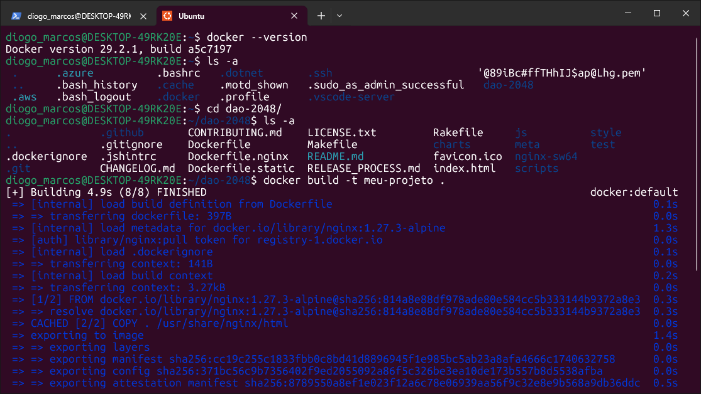
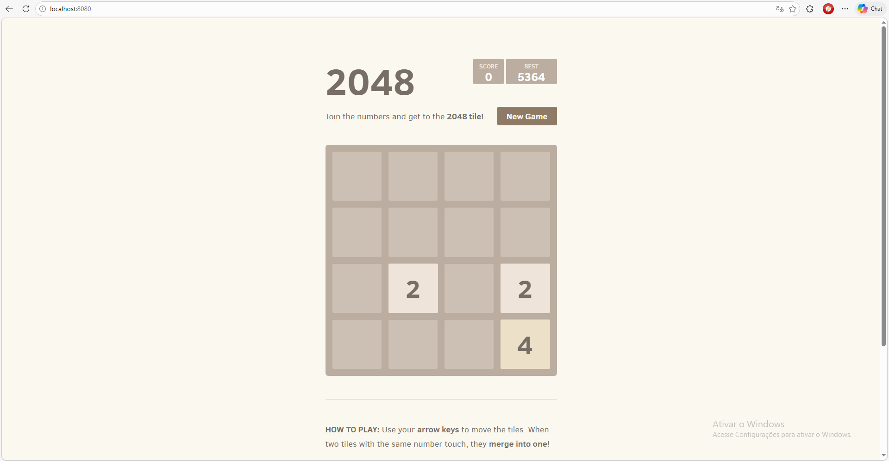
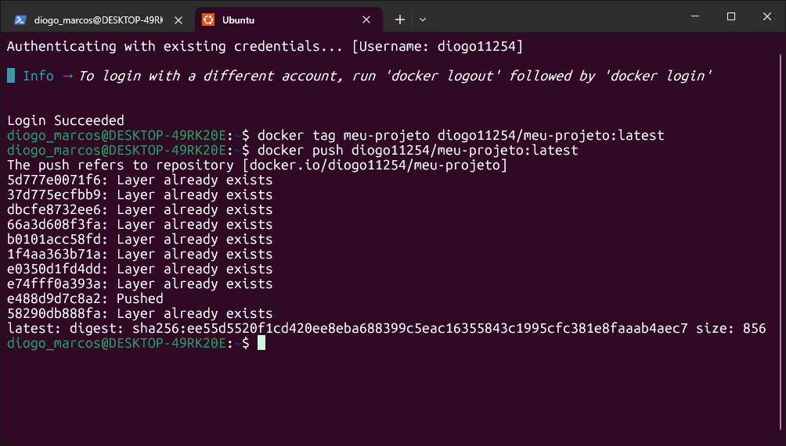
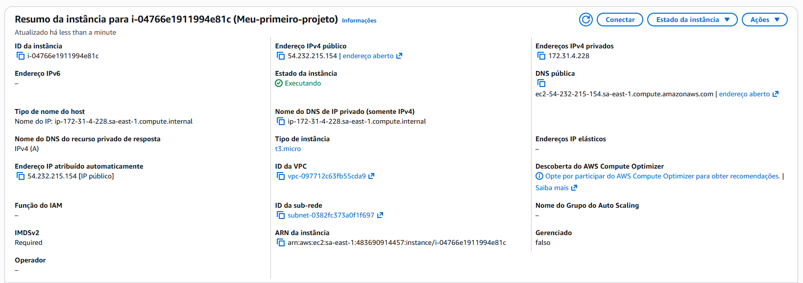
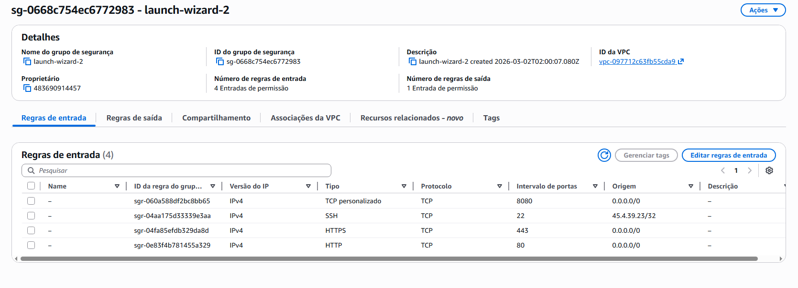
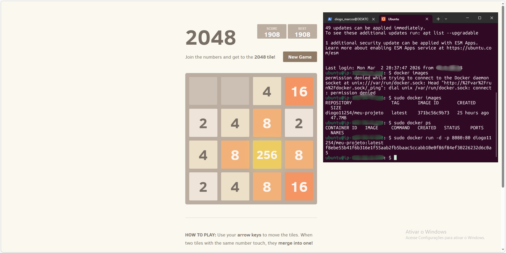
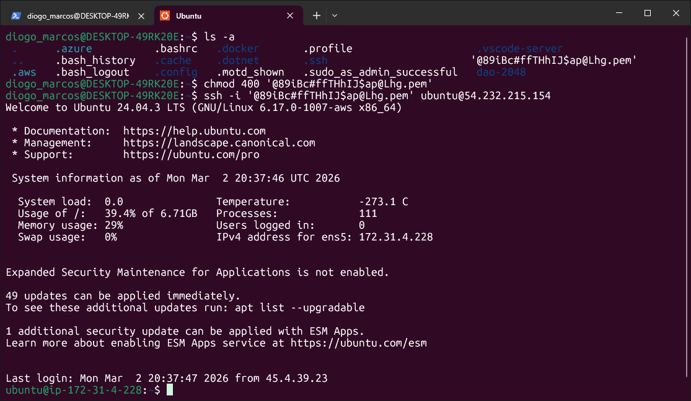

<h1 align="left">Deploy de aplicação containerizada na AWS EC2 com Docker</h1>

###

<h3 align="left">📌 Descrição</h3>

###

Este projeto demonstra o deploy manual de uma aplicação web containerizada em uma instância Amazon EC2, utilizando Docker e Docker Hub como registry. O objetivo foi sair de um estudo puramente teórico sobre Cloud e AWS e aplicar os conceitos na prática, simulando um fluxo real de trabalho de um profissional DevOps/Cloud.

###

Durante o projeto foram aplicados conceitos de: - Containerização com Docker - Construção de imagens - Publicação em registry (Docker Hub) - Provisionamento de instância EC2 - Configuração de Security Groups - Acesso remoto via SSH - Troubleshooting de permissões e portas de rede

###

<h3 align="left">🛠️ Tecnologias Utilizadas</h3>

###

- Windows 10 - Linux - WSL2 - Ubuntu 24.04.4 LTS - Docker Desktop - Docker Hub - Git - AWS EC2 - Nginx - SSH

###

<h3 align="left">🎮 Aplicação Utilizada</h3>

###

A aplicação utilizada foi o jogo 2048 baseado no repositório:  DaoCloud Repositório: https://github.com/DaoCloud/dao-2048  A aplicação não foi desenvolvida por mim. O foco deste projeto é a infraestrutura e o processo de deploy em ambiente cloud.

###

<h3 align="left">🔧 Etapas do Projeto</h3>

###

<h4 align="left">1 - Configuração do Ambiente Local</h4>

###

- Instalação do WSL2 - Instalação do Ubuntu 24.04 LTS - Integração do Docker Desktop com WSL2 - Integração do VS Code com ambiente Linux  wsl --install docker --version

###

<h4 align="left">2- Build da Imagem Docker</h4>

###

<h5 align="left">2.1 - Dockerfile utilizado:</h5>

###

FROM nginx:1.27.3-alpine COPY . /usr/share/nginx/html EXPOSE 80 CMD sh /usr/share/nginx/html/scripts/start.sh

###

<h5 align="left">2.2 - Build da imagem:</h5>

###

docker build -t meu-projeto . docker images

###

<h5 align="left">2.3 - Execução local:</h5>

###

docker run -p 8080:80 meu-projeto

###

<h5 align="left">2.4 - Teste realizado:</h5>

###

http://localhost:8080

###

<h4 align="left">3 - Publicação no Docker Hub</h4>

###

<h5 align="left">3.1 - docker login:</h5>

###

docker login

###

<h5 align="left">3.2 - Tag:</h5>

###

docker tag meu-projeto diogo11254/meu-projeto:latest

###

<h5 align="left">3.3 - Push:</h5>

###

docker push diogo11254/meu-projeto:latest

###

<h4 align="left">4 - Provisionamento da Instância EC2</h4>

###

<h5 align="left">4.1 - Definições:</h5>

###

- Região: sa-east-1 (São Paulo) - Tipo: t3.micro - Sistema Operacional: Ubuntu Server 24.04 LTS

###

<h5 align="left">4.2 - Security Group:</h5>

###

- Porta 22 liberada apenas para meu IP - Porta 80 liberada - Posteriormente porta 8080 liberada após troubleshooting - Acesso via chave .pem.

###

<h4 align="left">5 - Deploy na EC2</h4>

###

<h5 align="left">5.1 - Instalação do Docker:</h5>

###

sudo apt install docker.io sudo systemctl status docker

###

<h5 align="left">5.2 - Pull da imagem:</h5>

###

sudo docker pull diogo11254/meu-projeto:latest

###

<h5 align="left">5.3 - Execução:</h5>

###

sudo docker run -d -p 8080:80 diogo11254/meu-projeto:latest sudo docker ps

###

<h3 align="left">🧠 Troubleshooting e Aprendizados</h3>

###

<h4 align="left">Problema 1 – Permissões da chave .pem</h4>

###

Erro ao conectar via SSH devido a permissões inadequadas.

###

<h5 align="left">Solução:</h5>

###

chmod 400 arquivo.pem

###

<h5 align="left">Aprendizado:</h5>

###

- Entendimento de permissões Linux - Funcionamento do SSH com chave privada

###

<h4 align="left">Problema 2 – Porta 8080 não acessível</h4>

###

Após executar o container, o acesso via navegador não funcionava.

###

<h5 align="left">Investigação:</h5>

###

- Verificação de logs com docker logs - Container estava funcionando corretamente

###

<h5 align="left">Conclusão:</h5>

###

A porta 8080 não estava liberada no Security Group da EC2.

###

<h5 align="left">Solução:</h5>

###

Criação de regra de entrada liberando a porta 8080 (0.0.0.0/0).

###

<h5 align="left">Aprendizado:</h5>

###

- Entendimento prático de Security Groups - Conceito de portas expostas vs portas liberadas na nuvem

###

<h3 align="left">📱 Resultado Final</h3>

###

Aplicação acessível via IP público da EC2.

###

<h4 align="left">Teste realizado com sucesso:</h4>

###

###

<h3 align="left">📚 Principais Conceitos Fixados</h3>

###

- Fluxo completo de deploy manual - Diferença entre container e instância - Funcionamento do Docker Hub como registry - Segurança básica em Cloud - Permissões no Linux - Mapeamento de portas - Troubleshooting em ambiente real

###

  
  
  
  
  
  
  

###
